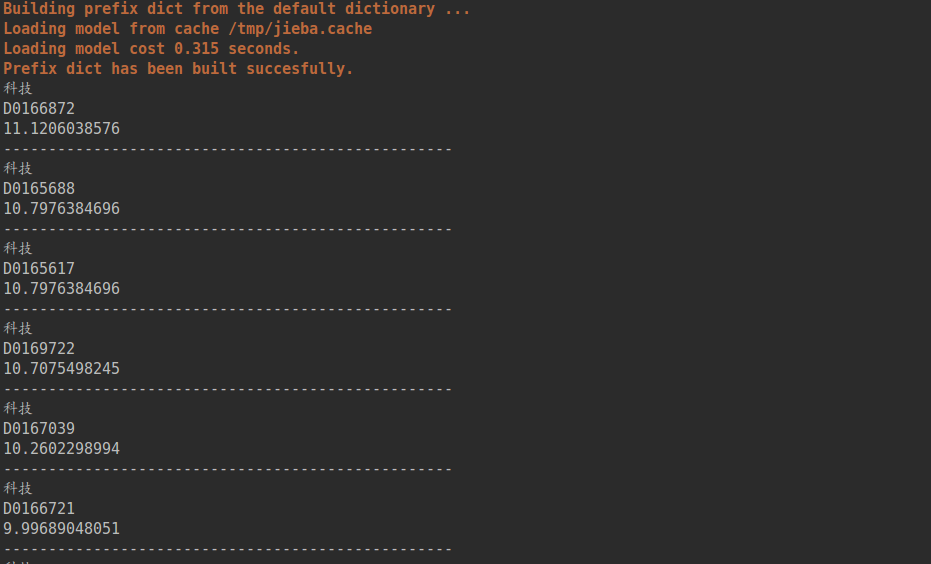

Whoosh 搜索引擎 
=====================
基于python的一款搜索引擎，用于文本的快速搜索。
blog_engine文件夹里面有5000篇文章,利用[倒排索引](https://blog.csdn.net/qq_24908345/article/details/52777379)处理得到

（其实是大一暑假项目整理，懒癌晚期 o(╯□╰)o  ）

## 1.Requirements
* Whoosh
* python 2.7

## 2.Models
代码细节可以参考我的 [Blog](https://blog.csdn.net/gdufsTFknight/article/details/72840872 "悬停显示") 
   
    $ python search.py
运行截图：
(关键词：科技）

## 3.Acknowledgment
  如果觉得不错的话，欢迎大家点击右上角的star和fork,谢谢！
  We hope that more people will join in our labs: `Data Mining Lab in GDUFS(广外数据挖掘实验室）`
